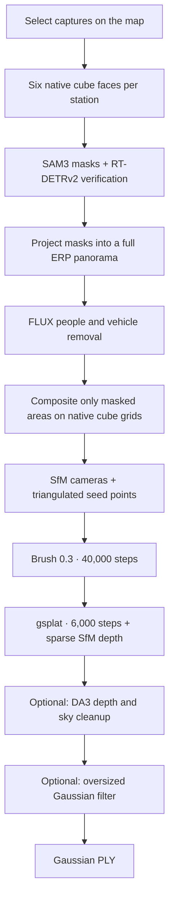

# Streetview to PLY

**Choose streetview on a map. Turn it into a Gaussian scene you can explore.**

[한국어](README.md) · [English](README.en.md)

`Map-based GUI` `Streetview → 3DGS` `SfM + Brush + gsplat` `Gaussian PLY` `Windows GUI / Linux GPU`

https://github.com/user-attachments/assets/5741d2f6-f14d-4e28-a2ff-5271d8f54f56

*21 seconds · 1920 × 1080 · silent. Existing Gwanghwamun test results, starting with an Unreal flight, followed by actual NAVER streetview, cube-face and panorama processing, Gaussian reconstruction, depth cleanup, and a result flythrough. This is an edited demonstration, not the full processing time.*

**Streetview to PLY** is a local GUI and CLI for selecting a map center and radius, inspecting real captures, and reconstructing **Gaussian PLY** from multiple capture stations. The current streetview provider is NAVER. The workflow connects people/vehicle removal, SfM camera recovery, Gaussian training, artifact cleanup, and export.

After installing the GUI, you can browse the map and save a selection. **PLY generation requires a separately configured Linux NVIDIA GPU environment, models, and tools.** Collection, image processing, SfM, and training run in sequence; duration depends on station count, image resolution, network, and GPU. The published source has not yet been run through a complete generation on a freshly installed GPU host.

[Uses](#uses) · [Pipeline](#pipeline) · [Requirements](#requirements) · [Installation](#installation) · [Usage](#usage) · [Outputs and options](#outputs) · [CLI](#cli) · [Limitations](#limits) · [References](#references)

<a id="uses"></a>
## What is it for?

| Purpose | What you can do |
| --- | --- |
| Spatial reference and previs | Reconstruct a roadside scene as Gaussians to explore camera movement and framing. |
| Capture review | Inspect locations and available capture periods on a map and in a 360° preview; include or exclude individual captures. |
| Repeatable work | Save processing presets and start a new job from a reusable completed stage. |
| Result preparation | Download PLY, filter oversized Gaussians, crop the output area, and open results in a configured Unreal project. |

<a id="pipeline"></a>
## Pipeline



- **Preserve the source outside removal masks.** SAM3 and RT-DETRv2 identify objects on native cube faces. Masks are projected into a full 2:1 equirectangular panorama (ERP) for FLUX removal, and the generated result is feathered into masked areas only. RGB outside the mask support stays exactly original. Vehicle shadows are not separately added to the mask.
- **Recover space from multiple views.** Training starts with SfM cameras and actual triangulated points. Generated regions and sky do not provide SfM correspondences. GPS is an auxiliary position prior.
- **Refine geometry as well as appearance.** The Brush result receives 6,000 more training steps in gsplat with a fixed Gaussian population. Image loss and sparse SfM inverse-depth loss jointly adjust appearance and depth consistency across views.
- **Control cleanup independently.** DA3 depth/sky cleanup and the oversized Gaussian filter have separate switches. DA3 supports cleanup; it is distinct from the SfM depth used during training.

The default recipe uses a 2048 × 1024 FLUX input and training images with a maximum dimension of 1280. Prepared images retain the native cube dimensions; generated areas do not thereby recover native-detail observations. See [Configuration](docs/CONFIGURATION.md) for the complete stage settings.

<a id="requirements"></a>
## Requirements

| Component | Requirement |
| --- | --- |
| Local GUI | Python 3.11 or newer, Git, and a current web browser. The primary instructions below use Windows PowerShell. |
| Map and streetview | Internet access and actual streetview coverage for the selected area. |
| PLY generation | A separate Linux NVIDIA CUDA host, SSH key access, Python environments, Brush 0.3, PyCOLMAP, gsplat, and image/depth models. See [GPU setup](docs/GPU_SETUP.md). |
| Existing PLY cleanup | A supported Gaussian PLY and camera JSON in the **same coordinate system**. Size filtering and cropping require no retraining. |
| Unreal preview · optional | Unreal Editor, MLSLabsRenderer, and an existing project with the required editor plugins enabled. PLY export does not require Unreal. |

Model weights, GPU environments, Unreal and its plugins, personal SSH settings, streetview photographs, and previous job outputs are not bundled.

<a id="installation"></a>
## Installation

1. **Clone the repository and install the GUI environment.** Install Python 3.11 or newer first. This example uses Python 3.11.

   ```powershell
   git clone https://github.com/tardis7732/streetview-to-ply.git
   cd streetview-to-ply
   py -3.11 -m venv .venv
   .\.venv\Scripts\python.exe -m pip install -e .
   ```

2. **Open the GUI.**

   ```powershell
   .\.venv\Scripts\python.exe -m tools.streetview_app.launch
   ```

   After installation, you can also double-click `Start Streetview.vbs`. The default address is `http://127.0.0.1:8765/`; the launcher chooses a free local port if that port is occupied.

3. **Connect a generation backend.** Follow [GPU setup](docs/GPU_SETUP.md) to prepare the execution host and models, then [Configuration](docs/CONFIGURATION.md) to register the backend and a preset. Restart the GUI afterward. A disabled generation button is expected on a fresh installation. Map browsing and selection saving remain available before connection.

<details>
<summary>Run the local GUI on Linux / macOS</summary>

Use Python 3.11 or newer and run these commands from the repository root. Follow the separate GPU setup guide for generation.

```bash
python3 -m venv .venv
. .venv/bin/activate
python -m pip install -e .
python -m tools.streetview_app.launch
```

</details>

Selections, presets, job records, and operator settings default to `tools/streetview_app/data/`, which is excluded from Git. For launcher problems, inspect `server.log` in the same directory.

<a id="usage"></a>
## Usage

The current GUI uses Korean labels. The steps below include their English meanings.

1. **Choose a center and radius.** Click the map or enter latitude/longitude. Set `수집 반경` (collection radius), then click `주변 거리뷰 조회` (find nearby streetview). The program imposes no upper limit on radius or capture count.
2. **Inspect the captures.** Choose an available `동일 날짜` (same day), `동일 월` (same month), or `전체` (all) condition. Click a station on the map or list to inspect its 360° preview. `네이버에서 열기` (open in NAVER) opens the source page. Excluded captures can still be previewed.
3. **Save your selection and settings.** Choose included captures, a processing preset, and removal/cleanup options. `선택한 설정 저장` (save selection settings) downloads the selection JSON. The default recipe requires at least three distinct physical capture stations.
4. **Start generation.** Check the connection status and selection, then click `Gaussian PLY 생성` (generate Gaussian PLY). Map queries, previews, and preset saving do not start training. Keep the local GUI server running while it owns a remote job.
5. **Review the result.** Check status in `작업 기록` (job history) and download the completed PLY. Open it in a configured Unreal project, or use `기존 PLY 정리` (clean existing PLY) to produce a new filtered output while keeping the original.

Capture metadata retains the precision actually supplied by the provider. A month-only record is not given an invented day or capture time. Provider metadata is checked again before generation. Even a large selection needs sufficient view overlap and successful camera registration.

<a id="outputs"></a>
## Outputs and options

| Output or control | Behavior |
| --- | --- |
| Gaussian PLY | A scene for a compatible Gaussian renderer. The tool does not generate a mesh or collision geometry. |
| Remove sky (`하늘 제거`) | Excludes sky from the RGB training mask. This is separate from depth/sky cleanup after training. |
| People/vehicle masks (`인물·차량 마스크`) | Enables native cube masks → whole-panorama removal → native-face composition. |
| Depth cleanup (`뎁스 기반 부유물 정리`) | Uses DA3 and sky evidence to clean artifacts after training. Uncertain non-sky depth can abstain from a deletion vote. |
| Oversized Gaussian filter (`큰 가우시안 제거`) | Deletes entire Gaussian rows whose largest standard deviation reaches the chosen fraction of the physical-camera radius. The default is 50%; smaller values remove more. |
| Crop output area (`출력 범위 자르기`) | In existing-PLY cleanup, crops the horizontal area around the capture-station center while preserving height. |
| Reuse completed stages | Checks reusable completed outputs and starts a new job from the chosen stage. |
| Open in Unreal (`언리얼 열기`) | Creates a new preview level in your configured project. Install the project and plugins separately. |

The size-reference radius is the maximum distance from the physical-station centroid to a station. Cube cameras at the same station are grouped together. This is separate from the collection radius entered on the map.

The default preset enables people/vehicle processing, depth cleanup, and size filtering, and disables sky removal from RGB training. The independent size filter can override protection from the depth-cleanup stage. Existing-PLY cleanup currently offers size filtering and cropping; it does not run DA3 inference again. The fixed two-stage recipe's training constants do not change simply by editing the GUI's generic advanced-setting fields.

<a id="cli"></a>
## CLI

The CLI uses the same **running local server** as the GUI. Activate the installed virtual environment first. `selection.json` must be a real selection saved from the GUI; replace `RECIPE_ID` and `JOB_ID` with values returned by the server.

```powershell
.\.venv\Scripts\Activate.ps1
streetview presets
streetview generate --config selection.json --recipe-id RECIPE_ID
streetview status JOB_ID
streetview reuse JOB_ID
streetview reuse JOB_ID --from-stage export
streetview open-unreal JOB_ID
```

If PowerShell blocks environment activation, replace `streetview` with `.\.venv\Scripts\python.exe -m tools.streetview_app.workflow_cli`. If the GUI uses another port, pass its actual address, for example `streetview --server http://127.0.0.1:PORT presets`.

You can run only the size filter on an existing PLY without the server. The PLY and camera JSON must use the same coordinate system; choose a new output directory.

```bash
python -m tools.streetview_engine.size_filter --input scene.ply --cameras cameras.json --output-dir outputs/filtered --ratio 0.5
```

Development dependencies and relevant checks:

```bash
python -m pip install -e ".[dev]"
python -m pytest tools/streetview_app/tests/test_server.py tools/streetview_app/tests/test_selection.py tools/streetview_engine/tests/test_size_filter.py
```

The source is split into `tools/streetview_app` (GUI, API, CLI), `tools/streetview_engine` (generation and cleanup), and `tools/streetview_geometry` (shared geometry).

<a id="limits"></a>
## Practical limitations

- **Reconstruction depends on observed views.** Accurate roofs, aerial views, or occluded surfaces are not guaranteed when absent from the input. Insufficient floor evidence does not justify inventing a floor plane.
- **Removed regions contain generated imagery.** FLUX-filled backgrounds and DA3 depth are not observations or survey measurements. Review Gaussian PLY as a visualization output.
- **One test scene does not establish quality elsewhere.** Gwanghwamun is a test dataset. The default algorithms do not use location names, chosen captures, or manually drawn floor regions as exceptions. The default recipe trains on all selected stations and does not produce a held-out-view quality score.
- **Feasible scale depends on data and hardware.** An uncapped selection is not unlimited provider coverage or guaranteed generation. Camera registration, memory, and runtime remain constraints.
- **Gaussian initialization starts with SfM.** SHARP/UniSHARP-predicted Gaussians are not used for initialization or fusion. Single-panorama UniSHARP generation is not provided.

<a id="references"></a>
## References

| Project | Role or relationship |
| --- | --- |
| [YellowO2 / streetview-to-3dgs](https://github.com/YellowO2/streetview-to-3dgs) | Inspiration for connecting streetview to Gaussian scenes. This repository uses a different processing pipeline. |
| [COLMAP](https://github.com/colmap/colmap) | The basis for camera recovery and SfM seed points. |
| [Brush](https://github.com/ArthurBrussee/brush) | Gaussian training in the default recipe, using version 0.3. |
| [gsplat](https://github.com/nerfstudio-project/gsplat) | Gaussian rendering and refinement. |
| [SAM 3](https://github.com/facebookresearch/sam3) | Object masks on native cube faces. |
| [Depth Anything 3](https://github.com/ByteDance-Seed/Depth-Anything-3) | Auxiliary depth for cleanup after training. |

See [References](docs/REFERENCES.md) for the full list, including RT-DETRv2, FLUX.2, map/streetview sources, and Unreal integration. Installation details are in [GPU setup](docs/GPU_SETUP.md); execution settings are in [Configuration](docs/CONFIGURATION.md).

Third-party software, models, and map data retain their providers' usage and license terms. This repository is not an official project of NAVER, the model authors, or the Unreal plugin authors.
