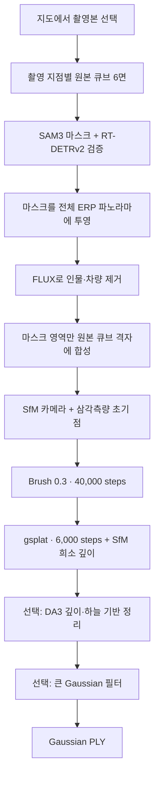

# Streetview to PLY

**지도에서 고른 거리뷰를, 둘러볼 수 있는 Gaussian 공간으로.**

[한국어](README.md) · [English](README.en.md)

`Map-based GUI` `Streetview → 3DGS` `SfM + Brush + gsplat` `Gaussian PLY` `Windows GUI / Linux GPU`

https://github.com/user-attachments/assets/5741d2f6-f14d-4e28-a2ff-5271d8f54f56

*21초 · 1920 × 1080 · 무음. 기존 광화문 테스트 결과를 바탕으로, 첫 언리얼 비행 장면부터 실제 네이버 거리뷰, 큐브 면·파노라마 처리, Gaussian 생성·깊이 정리와 결과 비행을 보여줍니다. 전체 처리 시간을 보여주는 영상은 아닙니다.*

**Streetview to PLY**는 지도에서 중심과 반경을 정하고, 실제 촬영본을 확인한 뒤 여러 촬영 지점으로부터 **Gaussian PLY**를 만드는 로컬 GUI와 CLI입니다. 현재 거리뷰 입력은 네이버를 사용합니다. 인물·차량 제거, SfM 카메라 복원, Gaussian 학습, 부유물 정리와 내보내기를 하나의 작업 흐름으로 연결합니다.

GUI 설치 후 지도 탐색과 선택 저장을 사용할 수 있습니다. **PLY 생성에는 별도로 구성한 Linux NVIDIA GPU 환경과 모델·도구가 필요합니다.** 수집, 이미지 처리, SfM, 학습이 차례로 실행되므로 처리 시간은 촬영 지점 수, 입력 해상도, 네트워크와 GPU에 따라 달라집니다. 공개 소스를 새 GPU 호스트에 설치한 뒤 전체 생성을 재실행한 검증은 아직 수행하지 않았습니다.

[활용](#uses) · [처리 과정](#pipeline) · [준비 사항](#requirements) · [설치](#installation) · [사용법](#usage) · [결과와 옵션](#outputs) · [CLI](#cli) · [한계](#limits) · [참고](#references)

<a id="uses"></a>
## 무엇에 쓰나요?

| 목적 | 할 수 있는 일 |
| --- | --- |
| 공간 참고·프리비즈 | 도로 주변을 Gaussian으로 재구성해 카메라 동선과 구도를 검토합니다. |
| 입력 촬영본 검토 | 지도와 360° 미리보기에서 촬영 시기와 위치를 확인하고 학습 포함·제외를 결정합니다. |
| 반복 제작 | 처리 설정을 프리셋으로 저장하고, 재사용 가능한 완료 단계에서 작업을 다시 시작합니다. |
| 결과 가공 | PLY를 다운로드하거나 큰 Gaussian과 출력 범위를 정리하고, 설정한 언리얼 프로젝트에서 엽니다. |

<a id="pipeline"></a>
## 처리 과정



- **원본을 보존하는 제거:** SAM3와 RT-DETRv2는 원본 큐브 면에서 객체를 찾습니다. 마스크를 2:1 ERP 파노라마로 옮겨 FLUX에 입력하고, 생성 결과를 마스크 영역에만 페더 합성합니다. 마스크 바깥 RGB는 원본 그대로 유지하며 차량 그림자를 별도로 확장하지 않습니다.
- **여러 시점으로 공간 복원:** SfM이 복원한 카메라와 실제 삼각측량 점에서 학습을 시작합니다. 생성된 영역과 하늘은 SfM 대응점의 근거로 사용하지 않습니다. GPS는 위치 복원의 보조값입니다.
- **기하를 포함한 추가 학습:** Brush 결과를 gsplat에서 6,000단계 더 학습합니다. Gaussian 개체수를 고정하고 영상 손실과 SfM 희소 역깊이 손실을 함께 사용해 여러 시점의 외관과 깊이 일관성을 조정합니다.
- **독립적인 정리 옵션:** DA3 깊이·하늘 기반 정리와 큰 Gaussian 제거는 각각 켜고 끌 수 있습니다. DA3는 정리의 보조 근거이며 SfM 학습 깊이와 구분합니다.

기본 레시피의 FLUX 입력은 2048 × 1024, 학습 영상의 최대 변 길이는 1280입니다. 합성 데이터는 원본 큐브 해상도를 유지하지만, 제거된 영역에 원본 수준의 세부 묘사가 복원되었다는 뜻은 아닙니다. 단계별 설정은 [운영자 설정](docs/CONFIGURATION.md)을 참조하세요.

<a id="requirements"></a>
## 준비 사항

| 구성 | 필요 조건 |
| --- | --- |
| 로컬 GUI | Python 3.11 이상, Git, 최신 웹 브라우저. 아래 설치 예시는 Windows PowerShell 기준입니다. |
| 지도·거리뷰 | 인터넷 연결과 해당 지역에서 실제 제공되는 거리뷰 촬영본. |
| PLY 생성 | 별도 Linux NVIDIA CUDA 호스트, SSH 키 연결, Python 환경, Brush 0.3, PyCOLMAP, gsplat, 이미지·깊이 모델. [GPU 설치 안내](docs/GPU_SETUP.md) 참조. |
| 기존 PLY 정리 | 지원하는 Gaussian PLY와 **동일 좌표계**의 카메라 JSON. 크기·범위 필터는 재학습 없이 실행합니다. |
| 언리얼 미리보기 · 선택 | Unreal Editor, MLSLabsRenderer와 필요한 편집기 플러그인이 활성화된 기존 프로젝트. PLY 내보내기에는 필요하지 않습니다. |

모델 가중치, GPU 실행 환경, 언리얼·플러그인, 개인 SSH 설정, 촬영 이미지와 기존 작업 결과는 저장소에 포함하지 않습니다.

<a id="installation"></a>
## 설치

1. **저장소를 받고 GUI 환경을 설치합니다.** Python 3.11 이상을 먼저 설치하세요. 아래는 Python 3.11을 사용하는 예시입니다.

   ```powershell
   git clone https://github.com/tardis7732/streetview-to-ply.git
   cd streetview-to-ply
   py -3.11 -m venv .venv
   .\.venv\Scripts\python.exe -m pip install -e .
   ```

2. **GUI를 엽니다.**

   ```powershell
   .\.venv\Scripts\python.exe -m tools.streetview_app.launch
   ```

   설치 후에는 `Start Streetview.vbs`를 두 번 클릭해도 됩니다. 기본 주소는 `http://127.0.0.1:8765/`이며, 포트가 사용 중이면 빈 로컬 포트를 선택합니다.

3. **생성 환경을 연결합니다.** [GPU 설치 안내](docs/GPU_SETUP.md)에 따라 실행 호스트와 모델을 준비한 뒤 [운영자 설정](docs/CONFIGURATION.md)에 따라 백엔드와 프리셋을 등록하고 GUI를 다시 엽니다. 새 설치에서 생성 버튼이 비활성화되는 것은 정상입니다. 지도 탐색과 선택 저장은 연결 전에도 사용할 수 있습니다.

<details>
<summary>Linux / macOS에서 로컬 GUI 실행</summary>

Python 3.11 이상을 사용해 저장소 루트에서 실행합니다. GPU 생성 환경은 위의 별도 설치 안내를 따릅니다.

```bash
python3 -m venv .venv
. .venv/bin/activate
python -m pip install -e .
python -m tools.streetview_app.launch
```

</details>

선택, 프리셋, 작업 기록과 운영자 설정의 기본 저장 위치는 `tools/streetview_app/data/`입니다. 이 경로는 Git에서 제외됩니다. 실행 문제는 같은 폴더의 `server.log`에서 확인할 수 있습니다.

<a id="usage"></a>
## 사용법

1. **중심과 반경 선택** — 지도에서 중심을 클릭하거나 위도·경도를 입력합니다. `수집 반경`을 설정하고 `주변 거리뷰 조회`를 누릅니다. 반경과 촬영 지점 수에 프로그램 상한은 없습니다.
2. **촬영본 확인** — 제공되는 `동일 날짜`, `동일 월`, `전체` 조건을 선택합니다. 지도나 목록의 지점을 눌러 360° 거리뷰를 확인하고, 필요하면 `네이버에서 열기`로 원본 페이지를 엽니다. 체크를 해제한 촬영본도 미리볼 수 있습니다.
3. **입력과 설정 저장** — 사용할 촬영본과 제작 프리셋, 제거·정리 옵션을 고릅니다. `선택한 설정 저장`으로 JSON을 내려받을 수 있습니다. 기본 레시피에는 서로 다른 실제 촬영 위치가 최소 3곳 필요합니다.
4. **생성 시작** — 연결 상태와 선택 내용을 확인하고 `Gaussian PLY 생성`을 누릅니다. 지도 조회·미리보기·프리셋 저장만으로는 학습이 시작되지 않습니다. 원격 작업 중에는 로컬 GUI 서버를 계속 실행해 둡니다.
5. **결과 검토** — `작업 기록`에서 상태를 확인하고 완료된 PLY를 다운로드합니다. 연결된 언리얼 프로젝트에서 열거나, `기존 PLY 정리`에서 원본을 보존한 새 결과를 만들 수 있습니다.

촬영 날짜는 제공자가 확인해 준 정밀도를 유지합니다. 월 단위 정보에 일자나 촬영 시각을 보태지 않으며, 생성 직전에 제공자 메타데이터를 다시 확인합니다. 촬영 범위가 넓더라도 실제 영상 중첩과 카메라 등록이 충분해야 합니다.

<a id="outputs"></a>
## 결과와 옵션

| 결과·옵션 | 동작 |
| --- | --- |
| Gaussian PLY | 호환되는 Gaussian 렌더러에서 볼 수 있는 결과입니다. 메시나 충돌용 지오메트리는 생성하지 않습니다. |
| 하늘 제거 | 하늘을 RGB 학습 마스크에서 제외합니다. 학습 후 깊이·하늘 정리와는 별도입니다. |
| 인물·차량 마스크 | 원본 큐브 마스크 → 전체 파노라마 제거 → 원본 면 합성 경로를 사용합니다. |
| 뎁스 기반 부유물 정리 | DA3와 하늘 근거로 학습 후 부유물을 정리합니다. 근거가 불충분한 비하늘 깊이는 삭제 판단을 보류할 수 있습니다. |
| 큰 가우시안 제거 | 가장 긴 축의 표준편차가 실제 촬영 위치 반경의 설정 비율 이상인 Gaussian 행 전체를 삭제합니다. 기본 비율은 50%이며, 작게 설정할수록 더 많이 제거합니다. |
| 출력 범위 자르기 | 기존 PLY 정리에서 촬영 위치 중심 주변의 수평 범위를 자릅니다. 높이는 유지합니다. |
| 완료 단계 재사용 | 재사용 가능한 완료 결과를 확인한 뒤 지정한 단계부터 새 작업을 시작합니다. |
| 언리얼 열기 | 설정된 프로젝트에 새 미리보기 레벨을 만듭니다. 프로젝트·플러그인은 별도 준비합니다. |

크기 기준 반경은 실제 촬영 위치들의 중심에서 가장 먼 촬영 위치까지의 거리입니다. 같은 지점의 큐브 카메라는 한 촬영 위치로 묶습니다. 지도에서 입력한 수집 반경과는 별개입니다.

기본 프리셋은 인물·차량 처리, 깊이 정리, 크기 필터를 켜고 RGB 학습의 하늘 제거는 끕니다. 크기 필터는 깊이 정리의 보호 규칙보다 우선할 수 있습니다. 현재 `기존 PLY 정리`는 크기·범위 필터를 제공하며 DA3 깊이를 다시 추론하지 않습니다. 기본 두 단계 레시피의 학습 상수는 GUI의 일반 고급 설정 숫자만으로 바뀌지 않습니다.

<a id="cli"></a>
## CLI

GUI와 동일한 **실행 중인 로컬 서버**를 사용합니다. 설치한 가상환경을 활성화한 뒤 실행하세요. `selection.json`은 GUI에서 저장한 실제 선택 파일이고, `RECIPE_ID`와 `JOB_ID`는 서버가 반환한 값을 사용합니다.

```powershell
.\.venv\Scripts\Activate.ps1
streetview presets
streetview generate --config selection.json --recipe-id RECIPE_ID
streetview status JOB_ID
streetview reuse JOB_ID
streetview reuse JOB_ID --from-stage export
streetview open-unreal JOB_ID
```

PowerShell에서 활성화가 제한되면 `streetview` 대신 `.\.venv\Scripts\python.exe -m tools.streetview_app.workflow_cli`를 사용할 수 있습니다. 기본 포트가 아닌 경우 `streetview --server http://127.0.0.1:PORT presets`처럼 실제 GUI 주소를 지정합니다.

서버 없이 기존 PLY의 크기 필터만 실행할 수도 있습니다. 카메라 JSON과 PLY는 같은 좌표계여야 하며 출력에는 새 디렉터리를 지정합니다.

```bash
python -m tools.streetview_engine.size_filter --input scene.ply --cameras cameras.json --output-dir outputs/filtered --ratio 0.5
```

개발 환경과 관련 검증 명령:

```bash
python -m pip install -e ".[dev]"
python -m pytest tools/streetview_app/tests/test_server.py tools/streetview_app/tests/test_selection.py tools/streetview_engine/tests/test_size_filter.py
```

소스는 `tools/streetview_app`(GUI·API·CLI), `tools/streetview_engine`(생성·정리), `tools/streetview_geometry`(공통 기하 처리)로 나뉩니다.

<a id="limits"></a>
## 알아둘 점

- **촬영된 시야가 복원의 근거입니다.** 상공, 지붕, 가려진 면처럼 입력에서 보이지 않는 공간의 정확한 복원을 보장하지 않습니다. 바닥 근거가 부족하면 임의의 바닥면을 만들지 않습니다.
- **제거 영역은 생성된 영상입니다.** FLUX가 채운 배경과 DA3 깊이는 실제 관측값이나 측량 결과가 아닙니다. Gaussian PLY는 시각화 결과로 검토해야 합니다.
- **테스트 장면의 결과를 다른 지역에 일반화하지 않습니다.** 광화문은 테스트 데이터이며, 기본 알고리즘은 장소명·특정 촬영본·수동 바닥 영역을 예외로 사용하지 않습니다. 기본 레시피는 모든 선택 지점을 학습에 사용하며 별도 보류 시점의 품질 점수를 만들지 않습니다.
- **실행 규모는 데이터와 장비에 좌우됩니다.** 상한 없는 선택이 무제한 수집이나 생성 성공을 뜻하지 않습니다. 제공 범위, 카메라 등록, 메모리와 처리 시간이 제약이 됩니다.
- **Gaussian 초기화는 SfM에서 시작합니다.** SHARP/UniSHARP가 예측한 Gaussian을 초기화·융합에 사용하지 않으며, 단일 파노라마 UniSHARP 생성 기능은 제공하지 않습니다.

<a id="references"></a>
## 참고 프로젝트

| 프로젝트 | 이 작업과의 관계 |
| --- | --- |
| [YellowO2 / streetview-to-3dgs](https://github.com/YellowO2/streetview-to-3dgs) | 거리뷰를 Gaussian 공간으로 연결하는 아이디어의 참고 프로젝트입니다. 이 저장소와 동일한 처리 파이프라인은 아닙니다. |
| [COLMAP](https://github.com/colmap/colmap) | 카메라 복원과 SfM 초기 점의 기반입니다. |
| [Brush](https://github.com/ArthurBrussee/brush) | 기본 레시피의 Gaussian 학습 도구입니다. 버전 0.3을 사용합니다. |
| [gsplat](https://github.com/nerfstudio-project/gsplat) | Gaussian 렌더링과 추가 학습에 사용합니다. |
| [SAM 3](https://github.com/facebookresearch/sam3) | 원본 큐브 면의 객체 마스크에 사용합니다. |
| [Depth Anything 3](https://github.com/ByteDance-Seed/Depth-Anything-3) | 학습 후 정리를 위한 깊이 보조값에 사용합니다. |

RT-DETRv2, FLUX.2, 지도·거리뷰와 언리얼 연동을 포함한 전체 출처는 [References](docs/REFERENCES.md)에 정리했습니다. 설치 조건은 [GPU 설치 안내](docs/GPU_SETUP.md), 실행 설정은 [운영자 설정](docs/CONFIGURATION.md)을 참조하세요.

제3자 소프트웨어·모델·지도 데이터는 각 제공자의 이용 및 라이선스 조건을 따릅니다. 이 저장소는 네이버, 모델 제작사 또는 언리얼 플러그인 제작사의 공식 프로젝트가 아닙니다.
